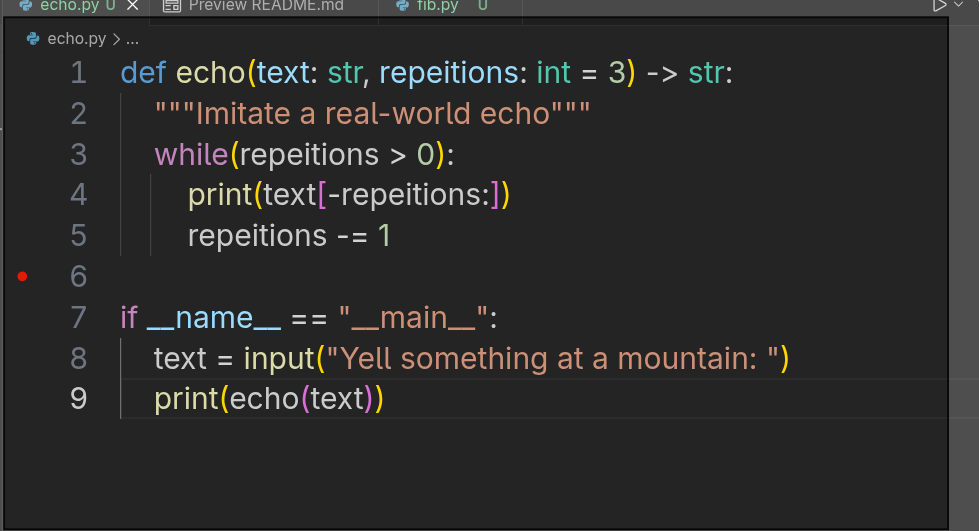
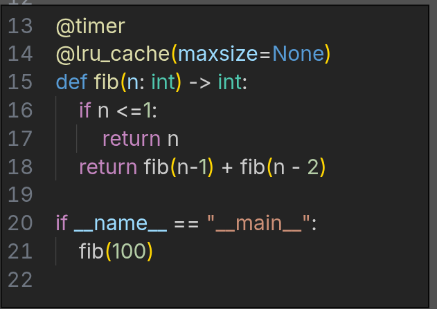
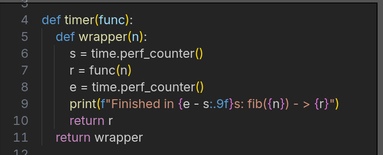

# PythonRefresher - Jayden A.
## Part 1 
* Added a simple ```while()``` loop to iterate.
* Using string splicing, we print the last ```n``` chars.
* Finally decrement repititons  by 1.


## Part 2
### Fib() Function:
* Base Case: if ```n``` is 0 or negative, we are finished and can return ```n```
* Recursive step: call fib at ```n-1``` and add fib at ```n-2```.


* Example output: Fib(10)


.png)

### Timer:
* A simple timer to track and output the runtime after each iteration


### Plotting:
* We capture the timing data from the ```timer``` function and store it in ```timings``` dict.
* Then write data out to a csv
* The csv file is passed to ```plot.py``` which graphs the data using matplotlib and saves as a png 
```final_plot.png```.
* The X-axis represents the ```repititons``` while the Y-axis shows the total runtime.

